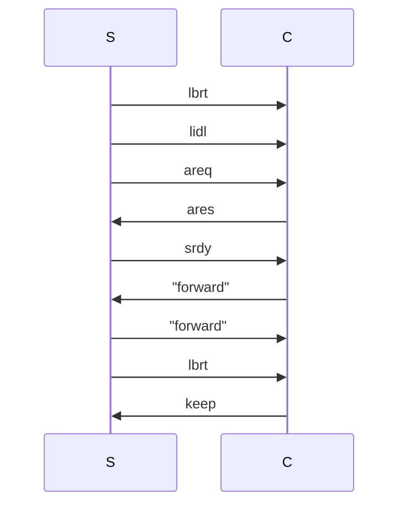

# SBD Spec

This SBD spec defines the protocol for SBD servers and clients to communicate.
SBD is a simple websocket-based message relay protocol. 

## 1. Websocket Stack

The SBD protocol is built upon websockets.

### 1.1. Websocket Configuration

#### 1.1.1. Message and Frame Size

The maximum SBD message size (including 32 byte header) is 20000 bytes.

SBD clients and servers MAY set the max message size in the websocket library to 20000 to help enforce this.

The maximum frame size MUST be set larger than 20000 so that sbd messages always fit in a single websocket frame.

## 2. Cryptography

### 2.1. TLS

Generally over the WAN SBD servers SHOULD be available over TLS (wss://), and on a LAN without (ws://).

### 2.2. Ed25519

Clients will be identified by ed25519 public key. Client sessions will be validated by ed25519 signature.

## 3. Protocol

### 3.1. Connect Path

Clients MUST specify exactly 1 http path item on the websocket connection url.
This item must be the base64url encoded public key that this client will be identified by.
This public key SHOULD be unique to this new connection.

### 3.2. Messages

#### 3.2.1. Header

SBD messages always contain first a 32 byte header. Messages less than 32 bytes are invalid.

If the header starts with 28 zero bytes, the message is a "command". Otherwise, the message is a "forward".

If the header is a "command" the next four literal ascii bytes are interpreted as the command type:

- `lbrt` - limit byte nanos - 4 byte i32be limit - server sent
- `lidl` - limit idle millis - 4 byte i32be limit - server sent
- `areq` - authentication request - 32 byte nonce - server sent
- `ares` - authentication response - 64 byte signature - client sent
- `srdy` - server ready - no additional data - server sent
- `keep` - keepalive - no additional data - client sent

If the header is a "forward" type, the 32 byte header is interpreted as the public key to forward the message to.
The remaining bytes in the message are the data to forward.

#### 3.2.2. Forward

When a client sends a "forward" message to the server, the first 32 bytes represent the
peer the message should be forwarded to.

When a server sends a "forward" message to the client the message should be forwarded to
the first 32 bytes will be altered to represent the peer from which the message originated.

#### 3.2.3. Flow

- If the server is in an overload state, it MAY drop incoming tcp connections
  immediately with no response even before doing any TLS handshaking.
- The server MUST send `areq` with a random nonce once for every newly opened connection.
  The server MAY send any limit messages before or after this `areq`, but it MUST come before the `srdy`.
- The client MUST respond with a signature over the nonce by the private key associated with the public key
  sent in the url path segment websocket request
- If the signature is valid the server MUST send the `srdy` message.
- After receiving `srdy` the client MAY begin sending "forward" type messages.
- At any point, the server MAY send an updated `lbrt` message.
- At any point after `srdy`, the server MAY send "forward" type messages to the client.
- At any point after `srdy`, the client MAY send a `keep` message.

#### 3.2.4. `lidl` and Keepalive

The `lidl` "Limit Idle Millis" message is the millisecond count the server will keep a connection around
without having seen any messages sent from that client. If a client does not have any forward messages
to send within this time period and wishes to keep the connection open they SHOULD send a `keep` message
to maintain the connection. Note this keep message will be counted against rate limiting.

#### 3.2.5. `lbrt` and rate limiting

The `lbrt` "Limit Byte Nanos" message indicates the nanoseconds of rate limiting used up by a single byte sent.
This is intuitively backwards of a "limit" because higher values indicate you need to send data more slowly,
but this direction is easier to work with in code. That is, if `lbrt` is 1, you can send one byte every nanosecond.
A more reasonable `librt` value of 8000 means you can send 1 byte every 8000 nanoseconds. Or more reasonably,
if you send a 16000 byte message, you should wait 8000 * 16000 nanoseconds before sending the next message.

A server MUST provide a "burst" grace window to account for message size.

A server MAY track rate limiting by some metric other than individual connection. IP address, for example.
Then, if additional connections are established from the same other metric, all connections could be notified
of needing to send data more slowly.

A client MAY wish to honor a slightly increased rate (e.g. lbrt * 1.1) to account for clock skew or network backlogs being dumped all at once.

#### 3.2.6. Extensibility

In order to make this protocol extensible without versioning, clients and servers MUST ignore unknown command types.
(With the exception that servers should still count the raw bytes in rate limiting.)

### 3.3. Violations

If a server receives an invalid message from a client it MUST immediately drop the connection with no closing frame.

If a server receives a message that violates the rate limit, the connection MUST similarly be dropped with no closing frame.
The server MAY also block connections (perhaps by IP address) for an unspecified amount of time.
